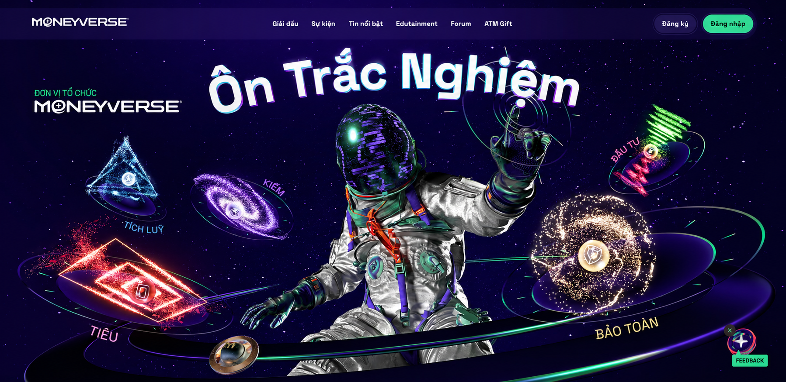

<div align="center">
  
  
  # 🌌 Vũ Trụ Đồng Tiền - TheMoneyVerse
  
  **Nền tảng ôn luyện trắc nghiệm và tư duy tài chính thế hệ mới.**
  
  [](https://nextjs.org/)
  [](https://www.typescriptlang.org/)
  [](https://tailwindcss.com/)
  [](https://www.framer.com/motion/)

</div>

## 📌 Giới thiệu (About)

**TheMoneyVerse** là một ứng dụng Web tương tác được thiết kế dành riêng cho việc học tập, ôn luyện kiến thức và nâng cao tư duy quản lý tài chính cá nhân, khởi nghiệp và đầu tư. 
Với giao diện lấy cảm hứng từ không gian vũ trụ (Cosmic UI) kết hợp hiệu ứng Glassmorphism hiện đại, ứng dụng mang đến trải nghiệm làm bài trắc nghiệm mượt mà, chuyên nghiệp và đầy cuốn hút.

Dự án vừa được cập nhật bộ dữ liệu độc quyền: **Phiên bản 2026 (500 CÂU MỚI)** bao trùm các lĩnh vực tài chính xanh, kinh tế số, Fintech, AI và thuế.

## 🚀 Tính năng nổi bật (Key Features)

- 🎨 **Giao diện Vũ Trụ (Cosmic UI)**: Thiết kế dark-mode tuyệt đẹp với các hạt bụi sao, vòng sáng gradient và hiệu ứng kính (Glassmorphism).
- 🧠 **Đa dạng ngân hàng câu hỏi**:
  - **Cơ Bản**: Các kiến thức nền tảng.
  - **2026 (500 câu mới)**: Độc quyền, cập nhật các xu hướng kinh tế vĩ mô, AI, ESG mới nhất.
- ⚡ **Tương tác Real-time**: 
  - Timer đếm ngược trực quan.
  - Phản hồi đúng/sai tức thì với animation mượt mà (Framer Motion).
- 📊 **Thống kê điểm số**: Tự động tổng hợp và đánh giá kết quả hành trình chinh phục "Vũ Trụ Đồng Tiền".

## 🛠 Công nghệ sử dụng (Tech Stack)

- **Framework**: Next.js (App Router)
- **Ngôn ngữ**: TypeScript
- **Styling**: Tailwind CSS
- **Animation**: Framer Motion
- **Icons**: Lucide React
- **Data**: JSON (Local Database)

## 💻 Hướng dẫn chạy dự án (Getting Started)

### Yêu cầu hệ thống (Prerequisites)
- [Node.js](https://nodejs.org/en/) (phiên bản 18.x trở lên)
- NPM hoặc Yarn

### Các bước cài đặt

1. **Clone dự án về máy**:
   ```bash
   git clone https://github.com/tunq25/TheMoneyVerse.git
   cd TheMoneyVerse
   ```

2. **Cài đặt các thư viện phụ thuộc**:
   ```bash
   npm install
   ```

3. **Khởi chạy môi trường phát triển (Dev server)**:
   ```bash
   npm run dev
   ```

4. **Truy cập ứng dụng**:
   Mở trình duyệt và truy cập vào [http://localhost:3000](http://localhost:3000).

## 📁 Cấu trúc thư mục (Folder Structure)

```text
TheMoneyVerse/
├── app/               # Next.js App Router (Giao diện chính, Layout, Metadata)
├── components/        # Các React Component tái sử dụng (Quiz UI, Controls)
├── data/              # Dữ liệu ngân hàng câu hỏi (questions.ts, 2026-demo.json)
├── public/            # Tài nguyên tĩnh (Logo, Banner, Images)
├── lib/               # Các utility functions
└── ...
```

## 👨‍💻 Tác giả (Author)

- **tunq25** - *Chủ tịch / Lead Developer*
- GitHub: [@tunq25](https://github.com/tunq25)

---
<div align="center">
  <i>Được xây dựng với 🩵 và ☕ bởi đội ngũ phát triển TheMoneyVerse.</i>
</div>
